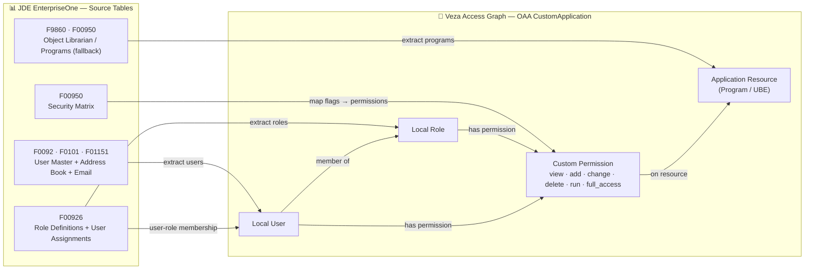

# JD Edwards EnterpriseOne → Veza OAA Integration

## Overview

This connector extracts identity and permission data from JD Edwards (JDE) EnterpriseOne via MS SQL Server and pushes it to Veza using the OAA (Open Authorization API) framework.

**Entity model surfaced in Veza Access Graph:**

| Veza Entity | JDE Source | Tables |
|---|---|---|
| Local User | JDE User | F0092, F0101, F01151 |
| Local Role | JDE Role | F00926 |
| Application Resource | JDE Program/UBE | F9860 |
| Permission | Security flags | F00950 |

**OAA Permission mapping:**

| Veza Permission | JDE Security Flag | OAA Canonical Types |
|---|---|---|
| `view` | FSIOK = Y | DataRead |
| `add` | FSA = Y | DataRead, DataWrite |
| `change` | FSCHNG = Y | DataRead, DataWrite |
| `delete` | FSDLT = Y | DataRead, DataWrite, DataDelete |
| `run` | FSRUN = Y | DataRead |
| `full_access` | All CRUD flags = Y | DataRead, DataWrite, DataDelete, MetadataRead, MetadataWrite |

---

## Entity Relationship Map

The diagram below shows how JDE source tables map to Veza OAA entities and how those entities relate to each other in the Veza Access Graph.



---

## How It Works

1. Connect to JDE MS SQL Server (or load from CSV sample files)
2. Query users from `F0092` with address book details from `F0101` / `F01151`
3. Query roles and user-role assignments from `F00926`
4. Query program objects (APPL + UBE) from `F9860`
5. Query security records from `F00950` mapping users/roles to programs with permission flags
6. Build a Veza OAA `CustomApplication` payload
7. Push to Veza (or save as JSON for dry-run inspection)

---

## Prerequisites

- Python 3.9 or later
- Microsoft ODBC Driver 17 or 18 for SQL Server ([install guide](https://learn.microsoft.com/en-us/sql/connect/odbc/linux-mac/installing-the-microsoft-odbc-driver-for-sql-server))
- Read access to the following JDE tables: `F0092`, `F00926`, `F9860`, `F00950`, `F0101`, `F01151`
- Veza API key with permission to create/update providers and datasources
- Network access from the connector host to the SQL Server instance

---

## Quick Start

```bash
curl -fsSL https://raw.githubusercontent.com/pvolu-vz/jde/main/integrations/jde/install_jde.sh | sudo bash
```

For non-interactive (CI/CD) install:

```bash
VEZA_URL=acme.veza.com \
VEZA_API_KEY=your_key \
JDE_DB_SERVER=sql-server.example.com \
JDE_DB_NAME=JDE_PRODUCTION \
JDE_DB_USER=jde_readonly \
JDE_DB_PASSWORD=secret \
sudo bash install_jde.sh --non-interactive
```

---

## Manual Installation

### RHEL / CentOS / Fedora

```bash
sudo dnf install -y git python3 python3-pip python3-venv unixODBC-devel
sudo useradd -r -s /bin/bash -m -d /opt/jde-veza jde-veza
sudo mkdir -p /opt/jde-veza/scripts /opt/jde-veza/logs
sudo git clone https://github.com/pvolu-vz/jde.git /opt/jde-veza/scripts
cd /opt/jde-veza/scripts/integrations/jde
python3 -m venv venv
./venv/bin/pip install -r requirements.txt
cp .env.example .env
chmod 600 .env
# Edit .env with your credentials
```

### Ubuntu / Debian

```bash
sudo apt-get update && sudo apt-get install -y git python3 python3-pip python3-venv unixodbc-dev
sudo useradd -r -s /bin/bash -m -d /opt/jde-veza jde-veza
sudo mkdir -p /opt/jde-veza/scripts /opt/jde-veza/logs
sudo git clone https://github.com/pvolu-vz/jde.git /opt/jde-veza/scripts
cd /opt/jde-veza/scripts/integrations/jde
python3 -m venv venv
./venv/bin/pip install -r requirements.txt
cp .env.example .env
chmod 600 .env
# Edit .env with your credentials
```

---

## Pre-Flight Validation

Before running `jde.py` for the first time, use `preflight.sh` to verify that all prerequisites are in place — Python version, ODBC driver, Python packages, `.env` configuration, SQL Server connectivity, and Veza API authentication.

### Run all checks at once

```bash
cd /opt/jde-veza/scripts/integrations/jde
chmod +x preflight.sh
./preflight.sh --all
```

Pass `--all` for automated/CI execution. Exit code is `0` on success, `1` if any critical check fails.

### Interactive menu

```bash
./preflight.sh
```

```
╔════════════════════════════════════════════════════════════╗
║     JD Edwards EnterpriseOne Pre-Flight Validation         ║
╚════════════════════════════════════════════════════════════╝

Validation Checks:
  1) System Requirements (Python, pip, ODBC driver, OS)
  2) Python Dependencies (packages)
  3) Configuration File (.env validation)
  4) Network Connectivity (SQL Server port, Veza HTTPS)
  5) API Authentication (SQL Server + Veza API key)
  6) API Endpoint Accessibility (Veza)
  7) Deployment Structure

SQL Validation:
  12) SQL Query Validation (TOP 2 rows per JDE table)

Comprehensive Tests:
  8) Run ALL Checks (recommended)

Utilities:
  9) Display Current Configuration
  10) Generate Template .env File
  11) Install Python Dependencies

  0) Exit
```

### What each check validates

| Option | What it checks |
|---|---|
| **1 — System Requirements** | Python ≥ 3.9, pip3, virtual environment, OS, curl, jq, ODBC driver (`odbcinst -q -d`) |
| **2 — Python Dependencies** | Each package in `requirements.txt`: `oaaclient`, `python-dotenv`, `requests`, `urllib3`, `pyodbc` |
| **3 — Configuration File** | `.env` exists, permissions are `600`, all required vars set and not placeholder values |
| **4 — Network Connectivity** | TCP reachability to `$JDE_DB_SERVER:$JDE_DB_PORT` and HTTPS to `$VEZA_URL:443` |
| **5 — API Authentication** | Live `pyodbc` connection with `SELECT @@VERSION`; Veza `GET /api/v1/providers` with Bearer token |
| **6 — API Endpoint Access** | Veza query API `POST /api/v1/assessments/query_spec:nodes` |
| **7 — Deployment Structure** | `jde.py` exists and is executable, `logs/` writability, service account |
| **12 — SQL Query Validation** | Executes `SELECT TOP 2` against all six JDE tables (`F0092`, `F00926`, `F9860`, `F00950`, `F0101`, `F01151`) and prints sample rows to confirm schema, column names, and SELECT access |

### Example output (successful run)

```
=== Running Complete Pre-Flight Validation ===

=== System Requirements Validation ===
✓ Python version 3.11.4 (>= 3.9 required)
✓ pip3 version 23.2.1 installed
⚠ Not running in virtual environment (recommended but not required)
ℹ Operating System: Red Hat Enterprise Linux 9.2
✓ curl installed (required for API tests)
⚠ jq not found (optional). Will use Python for JSON parsing
✓ ODBC driver found: ODBC Driver 18 for SQL Server

=== Python Dependencies Validation ===
ℹ Using venv Python: ./venv/bin/python
✓ requests==2.31.0 installed
✓ python-dotenv==1.0.1 installed
✓ oaaclient==1.1.2 installed
✓ pyodbc==5.0.1 installed
✓ urllib3==2.1.0 installed

=== Configuration File Validation ===
✓ .env file exists
✓ .env file permissions are secure (600)
✓ JDE_DB_SERVER set
✓ JDE_DB_PORT set
✓ JDE_DB_NAME set
✓ JDE_DB_USER set
✓ JDE_DB_PASSWORD set (abcd1234...)
✓ VEZA_URL set
✓ VEZA_API_KEY set (eyJhbGci...)

=== Network Connectivity Tests ===
✓ JDE SQL Server (sql-server.example.com:1433) - TCP port reachable
✓ Veza Instance (acme.veza.com:443) - HTTP 200 - 123.456ms

=== API Authentication Tests ===
✓ Veza API authentication successful (HTTP 200)
✓ SQL Server connection successful
ℹ Server version: Microsoft SQL Server 2019

=== Validation Summary ===
Passed:   18
Failed:   0
Warnings: 2

✓ All critical checks passed! JDE deployment is ready.

To run jde.py:
  cd /opt/jde-veza/scripts/integrations/jde
  ./venv/bin/python3 jde.py --dry-run --save-json
```

### Generating a fresh `.env` template

If no `.env` file exists yet, Option 10 creates one from the template and sets permissions to `600`:

```bash
./preflight.sh
# Select: 10
```

### Installing dependencies

Option 11 creates the `venv/` directory if it does not exist and installs all packages from `requirements.txt`:

```bash
./preflight.sh
# Select: 11
```

Equivalent to:
```bash
python3 -m venv venv
./venv/bin/pip install -r requirements.txt
```

---

## Usage

```
usage: jde.py [-h] [--data-dir DATA_DIR] [--env-file ENV_FILE]
              [--mssql-server MSSQL_SERVER] [--mssql-port MSSQL_PORT]
              [--mssql-db MSSQL_DB] [--mssql-user MSSQL_USER]
              [--mssql-password MSSQL_PASSWORD] [--jde-schema JDE_SCHEMA]
              [--veza-url VEZA_URL] [--veza-api-key VEZA_API_KEY]
              [--provider-name PROVIDER_NAME] [--datasource-name DATASOURCE_NAME]
              [--dry-run] [--save-json] [--log-level {DEBUG,INFO,WARNING,ERROR}]
```

### Arguments

| Argument | Required | Default | Description |
|---|---|---|---|
| `--data-dir` | No | — | Directory with CSV files; skips DB connection when provided |
| `--env-file` | No | `.env` | Path to .env credentials file |
| `--mssql-server` | Yes* | `JDE_DB_SERVER` | SQL Server hostname or IP |
| `--mssql-port` | No | `1433` | SQL Server TCP port |
| `--mssql-db` | Yes* | `JDE_DB_NAME` | JDE database name |
| `--mssql-user` | Yes* | `JDE_DB_USER` | Database login username |
| `--mssql-password` | Yes* | `JDE_DB_PASSWORD` | Database login password |
| `--jde-schema` | No | `dbo` | JDE table schema name |
| `--veza-url` | Yes* | `VEZA_URL` | Veza instance URL |
| `--veza-api-key` | Yes* | `VEZA_API_KEY` | Veza API key |
| `--provider-name` | No | `JD Edwards` | Provider label in Veza UI |
| `--datasource-name` | No | `JDE EnterpriseOne` | Datasource label in Veza UI |
| `--dry-run` | No | false | Build payload without pushing to Veza |
| `--save-json` | No | false | Save OAA payload as JSON for inspection |
| `--log-level` | No | `INFO` | Logging verbosity |

*Can be supplied via .env file or environment variable instead of CLI flag.

### Examples

**Dry-run with sample CSV files (no DB required):**
```bash
cd /opt/jde-veza/scripts/integrations/jde
./venv/bin/python3 jde.py \
  --data-dir ./samples \
  --dry-run \
  --save-json \
  --log-level DEBUG
```

**Live push using .env credentials:**
```bash
./venv/bin/python3 jde.py \
  --env-file .env \
  --log-level INFO
```

**Multiple JDE environments:**
```bash
./venv/bin/python3 jde.py \
  --env-file .env.prod \
  --datasource-name "JDE Production" \
  --log-level INFO

./venv/bin/python3 jde.py \
  --env-file .env.uat \
  --datasource-name "JDE UAT" \
  --log-level INFO
```

---

## Deployment on Linux

### Service account

```bash
sudo useradd -r -s /bin/bash -m -d /opt/jde-veza jde-veza
sudo chown -R jde-veza:jde-veza /opt/jde-veza
sudo chmod 700 /opt/jde-veza/scripts/integrations/jde
sudo chmod 600 /opt/jde-veza/scripts/integrations/jde/.env
```

### SELinux (RHEL)

```bash
getenforce   # should return Enforcing or Permissive
sudo restorecon -Rv /opt/jde-veza/scripts/
```

### Cron scheduling

Create `/etc/cron.d/jde-veza`:

```cron
# Run JDE → Veza OAA sync daily at 02:00
0 2 * * * jde-veza /opt/jde-veza/scripts/integrations/jde/venv/bin/python3 \
  /opt/jde-veza/scripts/integrations/jde/jde.py \
  --env-file /opt/jde-veza/scripts/integrations/jde/.env \
  --log-level INFO >> /opt/jde-veza/logs/cron.log 2>&1
```

### Log rotation

Create `/etc/logrotate.d/jde-veza`:

```
/opt/jde-veza/logs/*.log {
    daily
    rotate 30
    compress
    missingok
    notifempty
    su jde-veza jde-veza
}
```

---

## Multiple JDE Instances

Each JDE environment (Production, UAT, Dev) should have its own `.env` file:

```bash
# .env.prod  — points to production JDE DB and datasource name "JDE Production"
# .env.uat   — points to UAT JDE DB and datasource name "JDE UAT"
```

Stagger cron jobs by 30 minutes to avoid concurrent Veza pushes:

```cron
0 2 * * * jde-veza ... --env-file .env.prod --datasource-name "JDE Production"
30 2 * * * jde-veza ... --env-file .env.uat  --datasource-name "JDE UAT"
```

---

## Security Considerations

- **Credentials**: All credentials read from `.env` or environment variables — never hardcoded
- **File permissions**: `.env` must be `chmod 600`; scripts directory `chmod 700`
- **DB account**: Use a dedicated read-only SQL account with SELECT access only on the required tables
- **Least privilege**: Grant SELECT on: `F0092`, `F00926`, `F9860`, `F00950`, `F0101`, `F01151`
- **Credential rotation**: Update `.env` and restart cron when rotating Veza API keys or DB passwords
- **SELinux / AppArmor**: Run `restorecon` after any file relocation on RHEL

### Minimum SQL Server permissions

```sql
CREATE LOGIN jde_readonly WITH PASSWORD = 'StrongPassword!';
CREATE USER  jde_readonly FOR LOGIN jde_readonly;
GRANT SELECT ON dbo.F0092   TO jde_readonly;
GRANT SELECT ON dbo.F00926  TO jde_readonly;
GRANT SELECT ON dbo.F9860   TO jde_readonly;
GRANT SELECT ON dbo.F00950  TO jde_readonly;
GRANT SELECT ON dbo.F0101   TO jde_readonly;
GRANT SELECT ON dbo.F01151  TO jde_readonly;
```

---

## Troubleshooting

**`pyodbc` import error:**
```
pip install pyodbc
# RHEL: sudo dnf install -y unixODBC-devel
# Ubuntu: sudo apt-get install -y unixodbc-dev
```

**ODBC Driver not found (`Data source name not found`):**
Install Microsoft ODBC Driver 18:
```bash
# RHEL
curl https://packages.microsoft.com/config/rhel/9/prod.repo | sudo tee /etc/yum.repos.d/mssql-release.repo
sudo dnf install -y msodbcsql18

# Ubuntu
curl https://packages.microsoft.com/keys/microsoft.asc | sudo apt-key add -
sudo apt-get install -y msodbcsql18
```

**`Login failed` on SQL Server connection:**
- Verify `JDE_DB_USER` and `JDE_DB_PASSWORD` are correct
- Ensure the SQL login is enabled and not locked
- Check that SQL Server Authentication mode is enabled (not Windows-only)

**`ModuleNotFoundError: No module named 'oaaclient'`:**
```bash
./venv/bin/pip install -r requirements.txt
```

**Veza push warnings about missing identities:**
- Users without a valid email address in F01151 will not link to an IdP identity
- This is expected — the user will still appear as a Local User in Veza

**Empty payload / zero entities:**
- Confirm the JDE schema name is correct (`--jde-schema`)
- Run with `--log-level DEBUG` to see per-table fetch counts
- Verify the read-only SQL account has SELECT on all required tables

---

## Changelog

### v1.11 — Schema, collation, and program fallback (2026-04-21)
- Fixed SQL column references to match the actual JDE table schema after environment-specific differences were observed
- Added collation handling (`COLLATE SQL_Latin1_General_CP1_CS_AS`) for non-ASCII JDE values
- Added fallback: if `F9860` (Object Librarian) is not accessible, the program list is derived from distinct program references in `F00950`

### v1.10 — System account filtering (2026-04-21)
- Skips built-in JDE system accounts `EVERYONE`, `GNEADD`, `GNUSER`, and `GNDSP` during user and role extraction
- Prevents internal JDE system principals from appearing in the Veza access graph

### v1.9 — Runtime progress display (2026-04-21)
- Added real-time progress output to the terminal while `jde.py` is running (entity counts per step)

### v1.8 — Preflight SQL validation — Option 12 (2026-04-21)
- Added SQL Query Validation check to the preflight menu (Option 12)
- Runs `SELECT TOP 2` against all six JDE tables to verify schema, column names, and SELECT access

### v1.7 — Dependency updates (2026-04-20)
- Updated `oaaclient`, `pyodbc`, `requests`, and `urllib3` to latest compatible versions

### v1.6 — Provider and datasource naming (2026-04-20)
- Standardized default provider name to `JD Edwards` and datasource name to `JDE EnterpriseOne`
- Both remain overridable via `--provider-name` and `--datasource-name`

### v1.5 — Role assignment fix (2026-04-20)
- Fixed user-role assignment logic to correctly associate users with their JDE roles from `F00926`

### v1.4 — CLI parameter handling (2026-04-20)
- Made `--mssql-server`, `--mssql-db`, `--mssql-user`, `--mssql-password`, `--veza-url`, `--veza-api-key` optional on the CLI when supplied via `.env`
- All credential parameters fall back gracefully to environment variables

### v1.3 — Logging directory fixes (2026-04-20)
- Fixed log folder path resolution to ensure `logs/` is created relative to the script location
- Corrected log directory permissions

### v1.2 — Preflight validation script (2026-04-20)
- Added `preflight.sh` with 7-section validation: system requirements, Python dependencies, `.env` config, network connectivity, API authentication, Veza endpoint access, deployment structure
- Interactive numbered menu and `--all` batch mode (exit code `0` on success, `1` on any failure)
- Timestamped log written to `integrations/jde/preflight_<YYYYMMDD_HHMMSS>.log`

### v1.1 — Installer and deployment fixes (2026-04-20)
- Set default `REPO_URL` to `pvolu-vz/jde` in installer
- Changed deployment directory permissions from `700` to `755`
- Fixed repository URLs in README

### v1.0 — Initial release
- Full User → Role → Program security model from F0092, F00926, F9860, F00950
- Email identity linking via F0101 / F01151
- CSV dry-run mode for testing without database access
- Supports `--dry-run`, `--save-json`, `--data-dir`, `--jde-schema`, `--log-level`
- Permissions: view, add, change, delete, run, full_access
